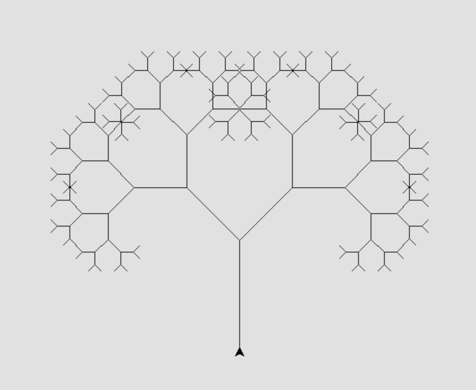
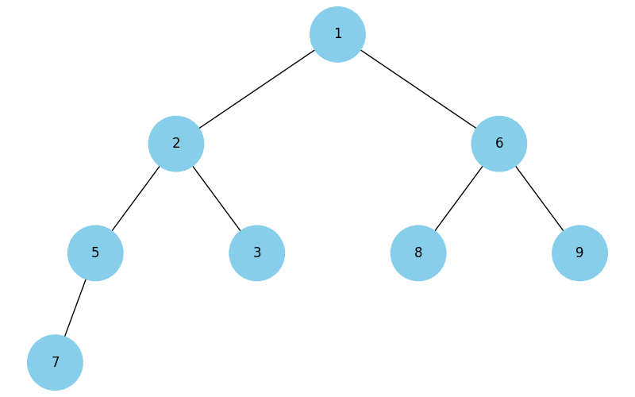
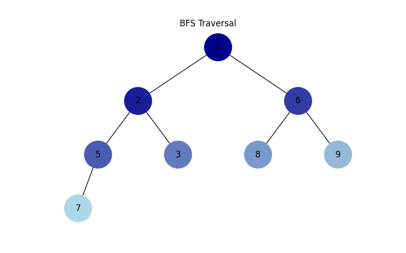
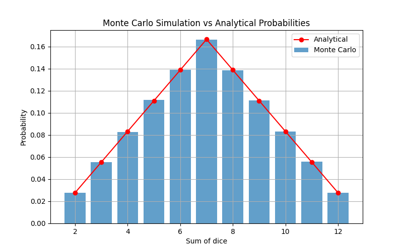
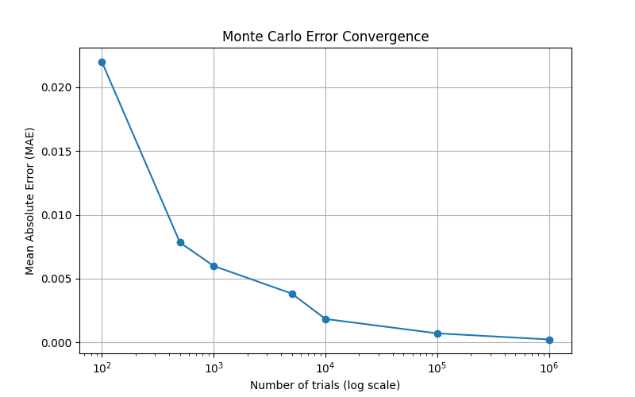

# Task 01 – Linked List (task01.py)

This program implements a singly linked list and required algorithms. 

### Implemented Functions
- **reverse()**  
  Reverses a singly linked list by changing links between nodes.

- **merge_sort(head)**  
  Implements a sorting algorithm (merge sort) for a singly linked list.

- **merge_sorted_lists(left, right)**  
  Merges two sorted singly linked lists into one sorted list.

All functions are implemented and tested for correctness.

# Task 02 – Pythagoras Tree (task02.py)

This program uses recursion to generate and visualize the Pythagoras Tree fractal.
The recursion level is provided by the user at runtime. The program executes correctly and visualizes the fractal.



# Task 03 - Dijkstra Algorithm (task03.py)

The Dijkstra algorithm is implemented using a binary heap (heapq)
to find the shortest paths in a weighted graph.
The graph is created using NetworkX.
Shortest paths from a start vertex to all other vertices are calculated. Example:

```
Shortest paths from vertex A:
A: 0
B: 4
C: 2
D: 7
E: 5
```

# Task 04 - Heap Tree (task04.py)
This program visualizes a binary heap.

An input array is converted into a binary heap using heapify.
The heap is then transformed into a binary tree and visualized
using NetworkX and Matplotlib.



# Task 05 - Tree Traversal Visualization (task05.py)

This program visualizes binary tree traversals.

DFS and BFS traversals are implemented iteratively using a stack and a queue.
During traversal, each node is colored with a unique blue shade that changes
from dark to light according to the visitation order.




# Task 06 – Greedy Algorithms and Dynamic Programming (task06.py)

This program solves the food selection problem under a limited budget
using two approaches: a greedy algorithm and dynamic programming.

Assumption:
Each food item can be selected at most once. This assumption is made because the problem statement does not
explicitly specify whether multiple quantities of the same item are allowed.

Both algorithms return the selected items, total calories,
and the total spent cost within the given budget.

```
Budget: 100

Greedy algorithm result:
Items: ['cola', 'potato', 'pepsi', 'hot-dog']
Total calories: 870
Spent cost: 80

Dynamic programming result:
Items: ['pizza', 'pepsi', 'cola', 'potato']
Total calories: 970
Spent cost: 100
```

# Task 07 – Monte Carlo Method (Dice Simulation)

This task implements a Monte Carlo simulation of rolling two dice.

A large number of dice rolls is simulated, and the sum of the two dice
is recorded for each trial. Based on the simulation results, the
probability of each possible sum (from 2 to 12) is calculated.

```
Number of trials: 100
Sum | Monte Carlo | Analytical | Error
---------------------------------------------
  2 | 0.0400     | 0.0278     | 0.0122
  3 | 0.0600     | 0.0556     | 0.0044
  4 | 0.0700     | 0.0833     | 0.0133
  5 | 0.1300     | 0.1111     | 0.0189
  6 | 0.1500     | 0.1389     | 0.0111
  7 | 0.1900     | 0.1667     | 0.0233
  8 | 0.1400     | 0.1389     | 0.0011
  9 | 0.0900     | 0.1111     | 0.0211
 10 | 0.0900     | 0.0833     | 0.0067
 11 | 0.0300     | 0.0556     | 0.0256
 12 | 0.0100     | 0.0278     | 0.0178
Mean Absolute Error (MAE): 0.014141

---------------------------------------------

Number of trials: 1000000
Sum | Monte Carlo | Analytical | Error
---------------------------------------------
  2 | 0.0275     | 0.0278     | 0.0003
  3 | 0.0554     | 0.0556     | 0.0001
  4 | 0.0836     | 0.0833     | 0.0003
  5 | 0.1115     | 0.1111     | 0.0003
  6 | 0.1388     | 0.1389     | 0.0000
  7 | 0.1665     | 0.1667     | 0.0002
  8 | 0.1391     | 0.1389     | 0.0002
  9 | 0.1104     | 0.1111     | 0.0007
 10 | 0.0837     | 0.0833     | 0.0003
 11 | 0.0558     | 0.0556     | 0.0003
 12 | 0.0277     | 0.0278     | 0.0001
Mean Absolute Error (MAE): 0.000257
```

The obtained probabilities are visualized and compared with the
analytical probabilities calculated theoretically.




Error convergence:

An additional plot shows how the mean absolute error changes depending
on the number of Monte Carlo trials. The error decreases as the number
of simulations increases, demonstrating convergence of the method.



### Conclusion:
As the number of simulations increases, the Monte Carlo results
converge to the analytical probabilities. This confirms the correctness
of the Monte Carlo method for estimating probabilities.
